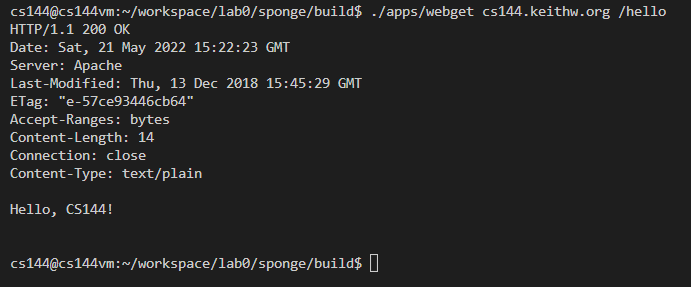
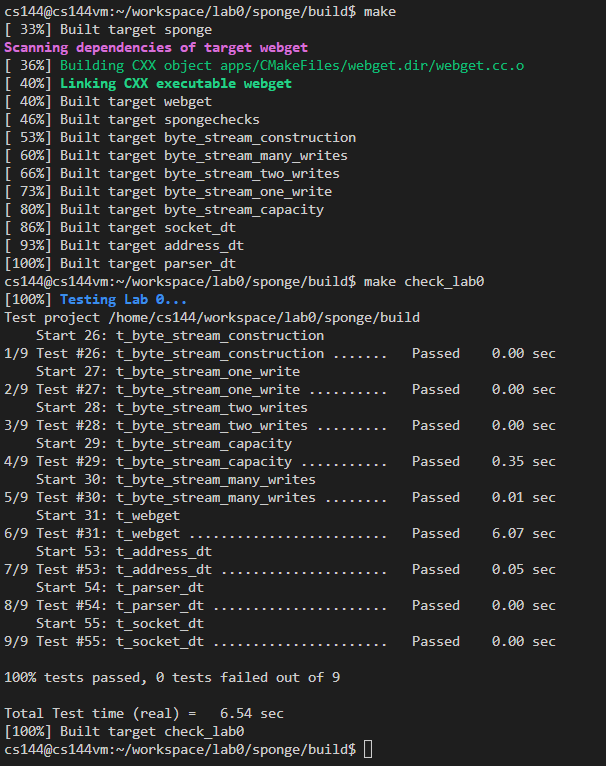

# notes about lab0

## 2.1 Fetch a Web page

this task is relatively easy, just simply follow the instructions.

## 2.2 Send yourself an email

i'm not a student of Stanford😂, i just simply did not have sunet id

## 2.3 Listening and connecting

this task is relatively easy, just simply follow the instructions.

## 3.4 Writing webget

personally, i did not think it was a good task. the instructions was simply not detailed enough. 

first of all, the instruction did not give a hint on what types api would be used. however, you can get some hints if you read about the `include "socket.hh"` and read the provided api.

second, it did not tell you the details about what to send to the server. only after i recall the operations in the 2.1 and the reminder of using `\r\n`, i figured out that it should send 4 lines of request.

third, it did not tell you how to judge the eof of the reading socket. agian, an proper api is hidden in the `file_descriptor.hh` named `eof()`

finally, when printing received data, you should not add an extra empty line, since the `make check_lab0` would make use of the last line

with all above information, this task would be very easy.

## 4 An in-memory reliable byte stream

this part basically ask you to implement a buffer just like a fixed size queue.
once you decide which data structure to choose, this task will be solved.
one intuitive solution is the ring queue buffer. i implement a simple ring queue for chars and use string directly as the inner container. notice that it may be good to make the string size one char larger than the real size, which may be helpful to distinguish whether the buffer is full or empty. however, my implementation did not make use of this feature and instead using extra varaibles to record the length.
**notice**: if you also wanna use string as the inner container for ring queue, extra attention should be paid when copy chars from the string. i found `substr` may cause some errors when i wanna copy charaters from some point in the string to the end of the string. to avoid this, i use `copy()` to handle string copying.

also, one thing you need to know is the difference between `buffer_empty` and `eof`. i was rather confused about the difference between them at first till i googled to find out that `eof` is `input_ended` plus `buffer_empty` 😂😂.

then, just finish coding and pass all the tests.

