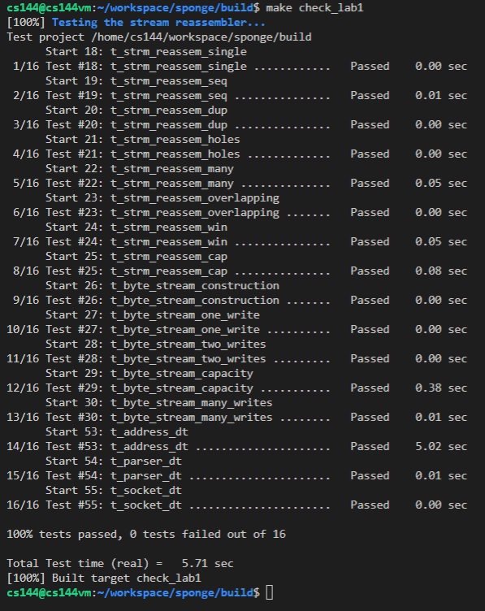

# notes about lab1

in this lab, the main task was stitching the different partial of packets and construct them back to the original packets.

obviously, a suitable data structure will be needed to hold store the unassembled partials and stitch them when all necessary packets were presented (like partial(3->5) and partial(6->8) is presented arrived first, if the next packet arrived is (4->7) then, these three partials will be connected to one partial(3->8)). actually, once the write data structure is chosen or implemented, this task will be finished immediately.

at first, two idea was popped out of my mind:
- using bit set to represent the positions of the unassembled bytes
- using set to store a bunch of small pieces each contains the information of unassmebled including the start/end position and string data

| method | pros | cons |
| --- | --- | --- |
| bit set | intuitive to represent the unassembled bytes, which makes it convinient to check whether the incoming data is overlapped with other data | need to adjust the informtaion when the data is assembled, that is, when the first few bits are popped out, you need to shift all the remainning bits left otherwise you will waste some part of the memory |
| set only store necessary information of each data | generally is memory efficeint, since the situations that bunches of small holes inside the whole unassembled data is not that common | need very detailed algorithm to check all the situations (like data overlapping) |

after considering the above two methods, i decided to choose method 2 which is generally memory efficient which is preferable by the requirements of the lab. since in this lab, the number of data to be processed is generally small, which means speed is not that important.

basically, i choose `set` to be the inner container of my data structure which at lower level is a red-black tree, where inserting and erasing data would be fast. 

after deciding which data structure will be used, all i need to do is exhausting all possible situations and debug with the test cases.

notice that all test cases is passed within half seconds except the one using the internet. you may find it helpful to run the test cases multiple times since in some test cases random data generation is applied, which means you may accidently pass sometimes even there are some small bugs in your implementaion.