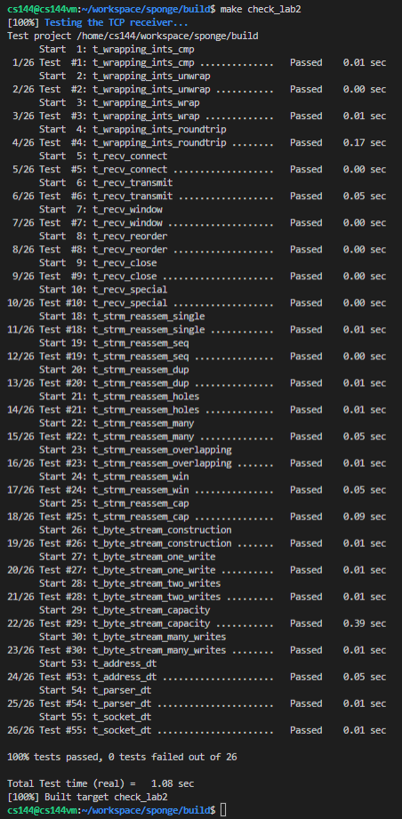

# notes about lab2

## 3.1 Translating between 64-bit indexes and 32-bit seqnos

from absolute seqno to seqno is easy, we just take `(n+isn)mod(2^32)`. however, to avoid overflow, it is better to take mod of n and isn respectively before taking care of their sum. that is `((n%(2^32))+(isn%(2^32)))mod(2^32)`. 

from seqno to absolute seqno is relatively complex. first we need to calculate the distance between the n and isn. after that, we just add the multiple of 2^32 to the distance and choose the one closest to checkpoint. one of easy and stupid way is simple divide checkpoint by 2^32 and consider the value near the divided result. that is, `k = checkpoint/(2^32)` and then choose the one which is closest to checkpoint from `distance+(k-1)*(2^32)`, `distance+(k)*(2^32)` and `distance+(k+1)*(2^32)`.

## 3.2 Implementing the TCP receiver

to finish this task, we only need to make clear of the following values:
- ISN: directly record the seqno of the packet with SYN in header
- FIN: once the FIN flag arrive, record the absolute seqno of the end of the packet that is `(absolute seqno of the starting point of the packet)+length-1`
- ackno: if input is ended, return the seqno of next byte of FIN; otherwise, return the corresponding indexes of the first unassembled in the streamBuffer
- data index of push_subtring: if the incoming packet contains SYN, set it to 0; otherwise, set it to its ((absolute seqno)-1)

with all information above, just coding and debugging with the test cases, this task will be finished.

