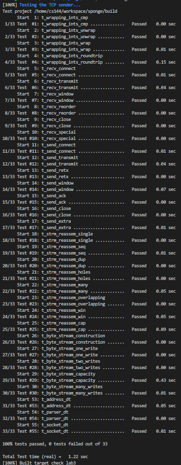

# notes about lab3

in this labs, the main task is to finish the 3 required functions

- fill_window():
    the basic idea is easy, that is, simply retrieve as much data as the window size of reciever allows from the sender's stream buffer and packet them into small packets. if SYN has not be sent, then it must be sent first. also, if the window size allows, you need to send FIN once the data in the sender's buffer is all retrieved and the buffer is closed (in other words, eof is true). notice that, the SYN and FIN flags will not occupy space in the packet payload, however its sequence number will occupy space in window size. according to the test case, when the window size is 0, you need to treat it as 1 and not backoff timer.

- ack_received():
    if the input ackno is no larger than the number of next seqno will be sent by the sender, then remove all the stashed packets in the data structure and update the window size. after updating the data structure and window size, you need to fill_window again.

- tick():
    just record the time elapsed since last tick and resend first data packet stored in the data structure and update RTO when needed.

then start coding and debug with the test cases

