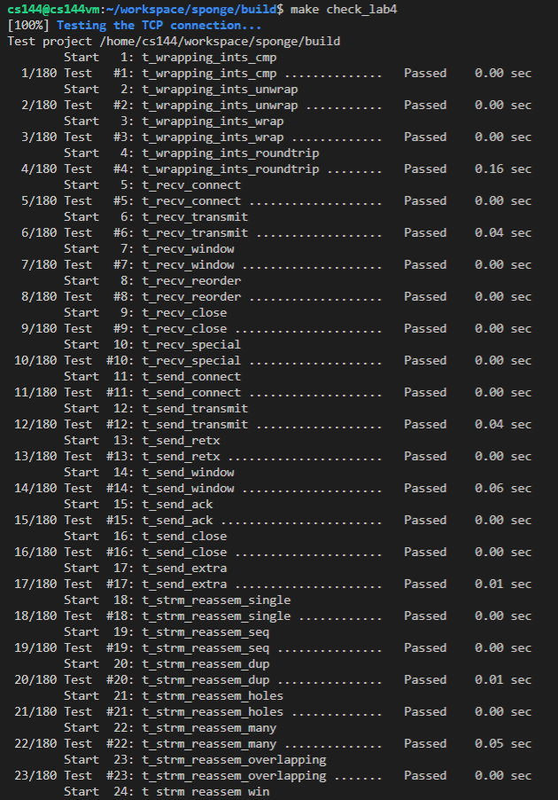
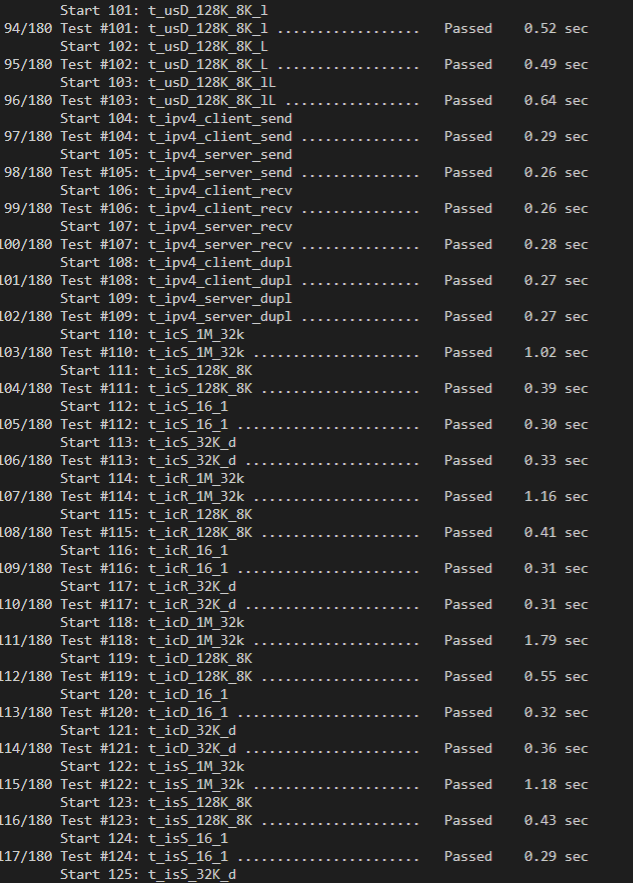

# notes about lab4

the instruction for this lab is quite detailed. just followed the instructions and code and debug.

notice that if you want to using printing to debug, you may need to use cerr instead of cout. for the test using txrx.sh, it may include the output of cout as part of the incoming packet if you used cout. then it may fail the test and since the recieved packet is different from real packet.

also, for the test#177, it may fail sometime. after checking, i found that it may be the problem of the testing program, that is, the socat. i use tcpdump to collect the data from tun145 which is copied [here](buginfo.txt). and you can find at the end of the file, the tcpdump shows that seqno sent by the last packet test program is `57345` instead of 128k which is `131072`, shown in the following:

and in the result, all packet is count as correct by tcpdump which means my program did not sent invalid ackno. the testing program sent the bytes `57345` with fin, that why my program would then end just as the instruction said. so i believed the problem was with the testing program.

---

if you coded followed the instruction and webget will work without a problem.

