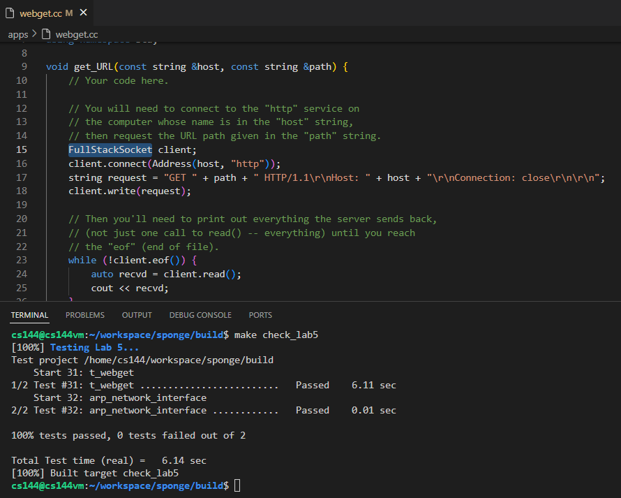
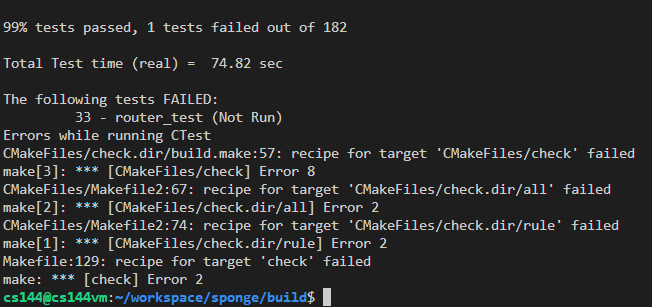

# notes about lab5

for this lab, the basic task is quite easy compare to the previous labs.
in my codes, i use three simple data structure to hold informtaion necessary.

- std::unordered_map<uint32_t, std::pair<EthernetAddress, size_t>> _arp_cache{}
    <ipv4 addr, <MAC addr, time existed in cache>>
- std::unordered_map<uint32_t, size_t> _arp_in_flight{}
    <ipv4 addr, time since last the arp request sent>
- std::vector<std::pair<EthernetFrame, uint32_t>> _frames_out_dst_not_known{}
    <unsent packet because of unknown MAC for dst ip, dst ip>

with above three data structures, all necessary data could be stored to finish the task.

---

---

