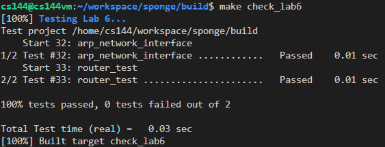
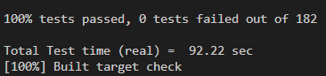
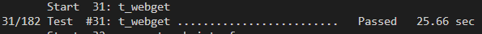
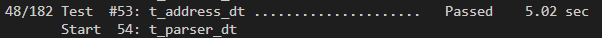

# notes about lab6

the task for this lab is quite easy, which is to implement two simple functions of router. but before that, we need a data structure to hold the information of each rule in routing table. to make easy, i directly wrap all the stuffs of one rule (route_prefix, route_length, next_hop, interface_num) into a struct and store them inside a vector.

- add_route
  just put the rule inside one struct and append them in the vector.

- route_one_datagram
  for this  function, the most tricky part is how to check the prefix of the rule and the package are same. this is quite easy if we just consider a O(N) algorithm. we just iterate through all the elements and generate a bit mask according to the length of the prefix length to compare the destionation address and routing address. one of the implementation is:
  ```cpp
    auto match_rule = [dgram](route_info r_info)->bool{
            uint32_t mask{0}, one_bit_mask{0x80000000};
            for(uint8_t i=r_info.prefix_length;i>0;i--){
                mask += (one_bit_mask>>(i-1));
            }

            return ((r_info.route_prefix&mask) == (dgram.header().dst&mask));
        };
  ```
  **notice that**, you should drop the packet with invalid ttl and decrease ttl by one for the invalid packet.

with all help above, this task could be finished easily.



due to some special reasons, the network traffic between my computer and the one involved in webget test is quite slow. so i increase the statndard of time out a little.


and for the webget, it takes around 25s and for t_address is 5s. if deduct them from all test cases, the running time for each test would be around 0.3s which is acceptable.


