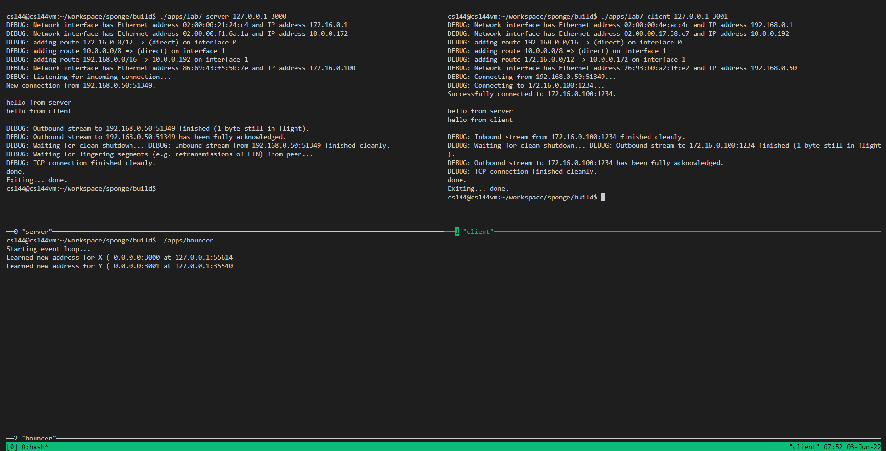
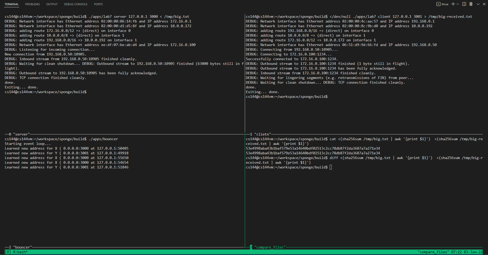

# notes about lab7

in this codes, no coding is required here, just some simple tests.

however, since when i'm doing this lab, it was already beyond the teaching scheduled time, which made me find something tricky.

in this lab, to make sure peers could exchange file even behind the NAT, the instructors configured their server somehow it can be used as a host for peers to talking to each other.

at first, i just found that my client and server programs at my local vm just could not communicate, which really frustrated me. 
after turning on the debug mode, i found that one important step could not be make, that is, the UDPSocket sending from each of my program just could not find each other. 
since my program had passed all the tests given before, i guess it may not be the problem of my program. so i decided to setup the environment inside my local vm. 
luckily, after checking the codes, i found the service used in the instructors' host, the `bouncer` program was given in the codes. 
then i decided to make my localhost as a service provider. however, after i started the client and server program, the bouncer program could not run whose error was that the address was in use. 
and the reason from that i guess is that maybe somehow the client and server program would create some udp sockets in the localhost and therefore conflict with some ports would be used in the bouncer. 
after i look through the codes of bouncer, i found that the bouncer would occupy all the ports from 1024 to 64000. however, the udp may choose some random ports from 4096 to 65535. 
so i decided to cut some ports for the bouncer to make it only use ports from 1024 to 4095. then the address occupying issue is solved.

---

## peer communication

---

## file transferring

**notice** that it will take some time to transfer the whole file, just patiently wait and the server and client programs would stop automatically once they were finished.

