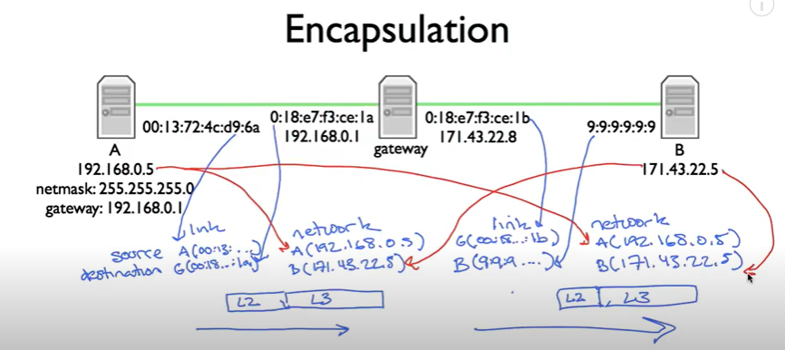

# lectures notes from 10 to 12

## Longgest Prefix Match

## Address Resolution Protocol(ARP)

in the above figure, a packet was sent from B. but when A sends its initial packet, it uses B's IP address while uses gateway's MAC address. after gateway received packet from A, it then changes the MAC address to B.

ARP:
- mapping between layer 2 and layer 3 addresses (nodes cache mappings, cache entris expire)
- simple request-reply protocol
- request sent to link layre broadcast address
- reply sent to requesting address (not broadcast)
- packet format includes redundant data (request has sufficient information to generate a mapping; makes debugging much easier)
- no "sharing: of state: bad state will die eventually (expired in cache)

arp is above link layer

