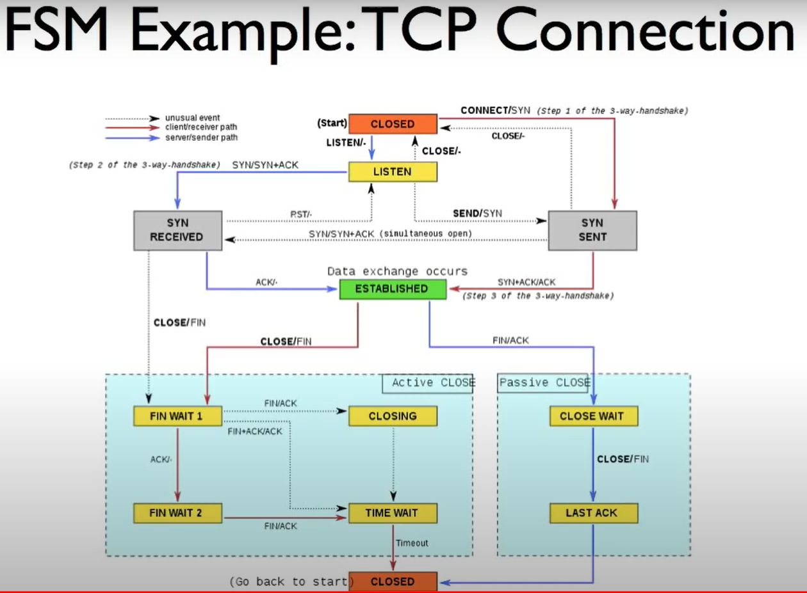

# lectures notes from 17 to 19

## The End-to-End Principle

the network does not have enough information to implement some functions which means end point needs to implement the functions and the network can only help

strong end to end (not implement in the middle)
network design become better and better but also become harder and harder to change

## Error Dectection: 3 schemes
calculacte CRC/checksum and append or prepend to data
- Checksum (TCP and IP)
    very fast and cheap. not very robust. if two bytes error occurs and cancel each other(one increase 32 and one reduce 32), then checksum would not find out.
- CRC (link layer)
    more expensive (easy today and easy in hardware). protect against any 2 bit error, and burst <= c bits long and odd number of errors
- MAC (TLS)
    robust to malicious modifications but not errors. if strong, any 2 messeges have a 2^-c chance of having the same code

## Finite State Machine

