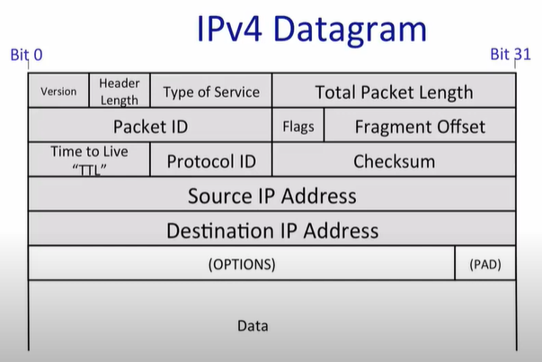

# lectures notes from 1 to 3

## Networked Applications

### common used patterns
bidirectional reliable byte-stream

### examples:
- www (http)
    archive-based request/response
- bittorrent
    tracker: track all connections between clients
    client: exchange files
- skype with complications (reverse connection)
    NAT makes it hard for one node outside in the Internet to make a connection with another node behind NAT
    - one side without NAT while another side behind NAT
        **rendezvous server**
        Assumed client A(without NAT) and client B(behind NAT)
        - step 1, node B establish a connection with rendezvous server
        - step 2, node A send "calling A" signal to rendezvous server
        - step 3, rendezvous server sends signal to inform B that a call is comming from Node A
        - step 4, B open a connection to A
    - both sides behind NAT
      **relay server**
      both nodes communication directly through relay server

---

## the four layer internet model

modularity

- link (enthernet/wifi)
  deliver packet hop by hop

- network layer
  datagrams
   - IP cannot promise datagrams be delivered 
   - IP will deliver packet out-of-order

- transport
  - TCP
  - UDP

- application
  - https

IP is the thin waist:
    many choices of link layer and transport layer, but for network layer, IP is a must

the 7-layer model
    make use of number of layer, e.g., network as 3rd layer in the 7-layer model

## IP service model

|property | behavior|
|---|---|
| datagram | hop by hop |
| unrealiable | packets may be dropped/duplicated/out of order |
| best effort | do things but only if necessary |
| connections | not store state; packets out of order |

---

why is the IP service so simple
- simple/dump/minimal: faster, more streamlined and lower cost to build and maintain
- end-to-end principle: where possible, implement feature in the end hosts, not build service in the internet itself
- allows a variety of reliable (or unreliable) services to be built on top
- works over any link layer: IP makes very few assumptions about the link layer below

---

the service model (details)
1. tries to prevent packets looping forever (TTL)
2. will fragment packets if they are too long
3. used a header checksum to reduce chances of delivering datagram to wrong destination
4. allows fot new versions of IP
   - currently IPv4 with 32-bit addresser
   - and IPv6 with 128-bit addresses
5. allows for new options to be added to header

---

IPv4 datagram

